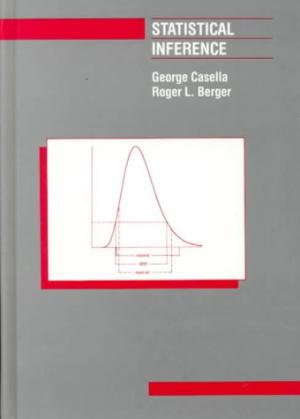

# General statistics and statistical modelling

## Books
Following are some great books that focus on a more practical introduction to statistics and statistical modelling (e.g. using R as a compute environment). The order of books loosely reflects the increase in complexity of the material covered.

Many introductory statistics textbooks exist. I am listing here [*Stats - Data and models* by de Veaux](http://www.bookdepository.com/STATS-Richard-D-de-Veaux/9780134243900) as the most modern introductory statistics book. It has received (and continues to receive) very positive reviews, covers the basics and more, and is targeting undergraduate students across different disciplines (biomedical sciences, social sciences, political sciences, physics, etc.). Unfortunately it is not cheap.

[Dalgaard](https://www.bookdepository.com/Introductory-Statistics-with-R/9780387790534) and [Casella & Berger](http://www.bookdepository.com/Statistical-Inference-George-Casell-Roger-Berger/9780495391876) are two introductory and more advanced statistics textbooks. [McElreath](https://www.bookdepository.com/Statistical-Rethinking-Richard-McElreath/9781482253443) offers a fantastic introduction to Bayesian statistics and modelling, with a minimum dependence on existing stats and maths knowledge. [Gelman et al.](https://www.bookdepository.com/Bayesian-Data-Analysis-Andrew-Gelman/9781439840955) is a very comprehensive treatise on Bayesian data analysis containing many practical examples.    

## Free ebooks

I have not used the [OpenIntro Statistics](https://www.openintro.org/stat/textbook.php) book but reviews have been very favourable. It's also free. OpenIntro also offers additional reading and course material.

## Web sources, blogs and online forums

[CrossValidated](http://stats.stackexchange.com/)   

CrossValidated is an online forum for people interested in statistics, machine learning, and data analysis. CrossValidated focusses on the theory and methodology of analysing data rather than on programming language-specific issues. Make sure to search through the CrossValidated records before posting a new question.
