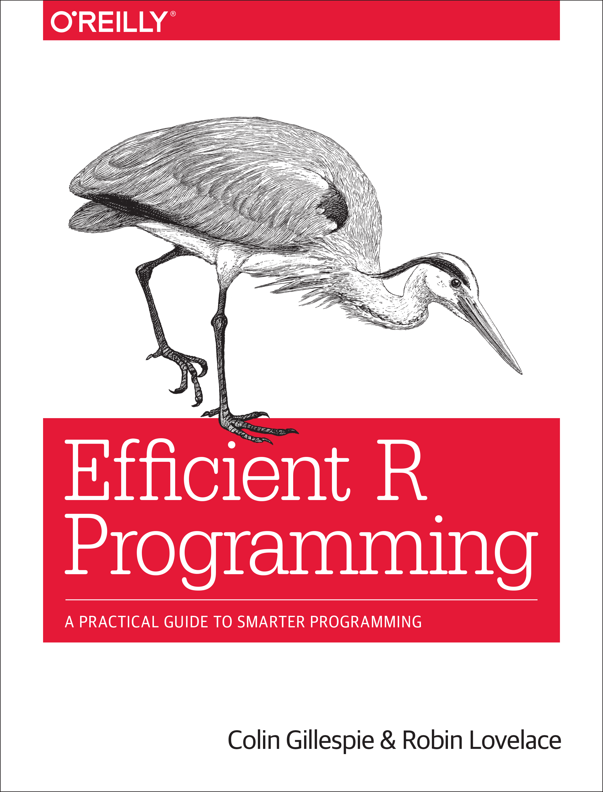
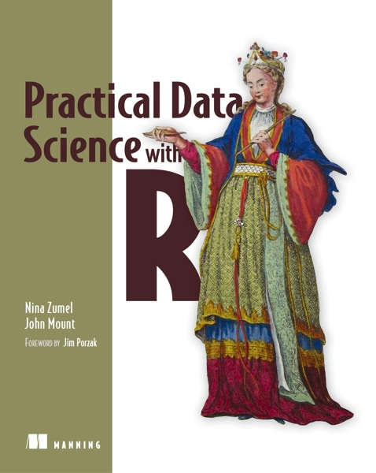

# R programming

*Disclaimer: The following sections list introductory and more advanced material on programming in R, without any claim of completeness.*

The order of the materials in every section roughly reflects increasing complexity/difficulty/comprehensiveness. I am listing tutorial materials and notes first and (e)books second, because in my opinion learning R requires a practical learning-by-doing and following-examples type of approach. The best thing to do is to "start coding" yourself right from the start.

It goes without saying that in order to be able to execute R code, you need to install the R compute environment on your computer. You can download R from the [R Project](https://www.r-project.org/).

[RStudio](https://www.rstudio.com/products/RStudio/) is a full IDE (integrated development environment) for code development, including an editor and tools for code management, debugging, and plotting. I highly recommend using it.

## Tutorial and notes

[Gautier, *R crash course*](http://www.cbs.dtu.dk/courses/thaiworkshop/exercises/crashR.2.pdf): A short (17 pages) crash course on programming in R.

I recommend this as a half-day crash-course introduction to R. I have used this material in the past when running R-based gene expression analysis courses for biologists.

---

[Venables et al., *An Introduction to R*](https://cran.r-project.org/doc/manuals/R-intro.pdf): Fairly comprehensive notes (105 pages) on R from CRAN.

This is a step up from the crash-course overview. Working through this should give you a good practical working knowledge of how to "do things" in R. Either read front-to-back or use alongside implementing some simple R projects.

---

[Phillips, *Yarrr! The pirate's guide to R*](https://drive.google.com/file/d/0B4udF24Yxab0S1hnZlBBTmgzM3M/view): From the book

> "This book is meant to introduce you to the basic analytical tools in R, from basic coding and analyses, to data wrangling, plotting, and statistical inference."

Phillips more or less covers similar ground to Venables, and also introduces some popular and useful R packages from the [tidyverse](https://blog.rstudio.org/2016/09/15/tidyverse-1-0-0/).

---

[Wickham, *Advanced R*](http://adv-r.had.co.nz/): From the website

> "The book is designed primarily for R users who want to improve their programming skills and understanding of the language."

From the master himself.

---

[Bryan et al., *Happy Git and GitHub for the useR*](http://happygitwithr.com): This is a tutorial on how to setup Git/GitHub within RStudio. It covers basic Git/GitHub and how to connect RStudio to Git/GitHub.

## Ebooks

Some of the following books cover very advanced topics. I would not recommend an R beginner starting with these; however, topics covered in these books will become relevant as computational R projects become more complex.  

---

[](https://www.manning.com/books/practical-data-science-with-r)

[Gillespie & Lovelace](https://csgillespie.github.io/efficientR/index.html) have an online version of their O'Reilly book [*Efficient R programming*](https://www.amazon.com/Efficient-Programming-Practical-Guide-Smarter/dp/1491950781). From the website:

> "There are many excellent R resources for visualization, data science, and package development. Hundreds of scattered vignettes, web pages, and forums explain how to use R in particular domains. But little has been written on how to simply make R work effectively—until now. This hands-on book teaches novices and experienced R users how to write efficient R code."

---

[ModernDive - An Introduction to Statistical and Data Sciences via R](https://ismayc.github.io/moderndiver-book/index.html) by Chester Ismay and Albert Y. Kim is an online open-source textbook, aiming at teaching students how to

1. use R to explore and visualise data,
2. use randomisation and simulation to build inferential ideas,
3. effectively create stories using these ideas to convey information to a lay audience.``

[Taken from the introduction]

---

[](https://www.manning.com/books/practical-data-science-with-r)

[Zumel & Mount](https://www.manning.com/books/practical-data-science-with-r) has received a lot of positive reviews. From the website:

> "Practical Data Science with R lives up to its name. It explains basic principles without the theoretical mumbo-jumbo and jumps right to the real use cases you'll face as you collect, curate, and analyze the data crucial to the success of your business. You'll apply the R programming language and statistical analysis techniques to carefully explained examples based in marketing, business intelligence, and decision support."

I haven't had a chance to check out this book yet; based on reviews and on the website, Zumel & Mount provide an introduction to practical R through typical data science problems involving statistical modelling, machine learning, data visualisation, etc.

---

[](https://www.manning.com/books/practical-data-science-with-r)


[Wickham & Grolemund](http://r4ds.had.co.nz) have an online version of their upcoming (late 2016) O'Reilly book [*R for Data Science*](https://www.amazon.com/R-Data-Science-Hadley-Wickham/dp/1491910399/ref=as_li_ss_tl?ie=UTF8&qid=1469550189&sr=8-1&keywords=R+for+data+science&linkCode=sl1&tag=devtools-20&linkId=6fe0069f9605cf847ed96c191f4e84dd).

---

[](https://www.manning.com/books/practical-data-science-with-r)


[James et al., *An Introduction to Statistical Learning with Applications in R*](http://www-bcf.usc.edu/~gareth/ISL/): From the website:

> "This book provides an introduction to statistical learning methods. It is aimed for upper level undergraduate students, masters students and Ph.D. students in the non-mathematical sciences. The book also contains a number of R labs with detailed explanations on how to implement the various methods in real life settings, and should be a valuable resource for a practicing data scientist."

This book can be considered the *little brother* of [*The Elements of Statistical Learning*](http://statweb.stanford.edu/~tibs/ElemStatLearn/).


---

[Rodrigues, *Functional programming and unit testing for data munging in R*](https://leanpub.com/fput): This is a pay-as-you-like ebook that discusses unit testing (using the R package `testthat`) and package development in R. It's currently (as of January 2017) 60% complete.


## Online courses

Various online courses exist. Following are two sites that provide links to practical online R courses. Some are free, some are not.

---

[R course finder](http://r-exercises.com/r-courses/): Provides a list of nearly 100 R courses, offered by various universities and institutes, in different formats, and at different costs (starting from free).

---

[R courses on coursera](https://www.coursera.org/courses?languages=en&query=r+programming): Introductory R courses exist from Johns Hopkins and Duke universities.

## Web sources, blogs and online forums

R has a very active community, and in my experience staying up to date with new developments requires at least occasionally following various web sources.

---

[https://cran.r-project.org/](https://cran.r-project.org/)

The Comprehensive R Archive Network (CRAN) is the central platform for R package distribution. Here you can search for available R packages, and access the often extensive R package documentation (in the form of vignettes and reference manuals).

All packages from CRAN can be installed directly from within R.
```{r eval=FALSE}
install.packages("package_name");
```

---

[https://www.bioconductor.org/](https://www.bioconductor.org/)

Bioconductor provides tools for the statistical analysis and visualisation of HTS data. This includes specialised R packages (including extensive vignettes and reference manuals) and tutorials.

All R/Bioconductor packages can be installed directly from within R.
```{r eval=FALSE}
source("https://www.bioconductor.org/biocLite.R");
biocLite("package_name");
```
---

[R-bloggers](https://www.r-bloggers.com/)

R-bloggers is an aggregate blog site, with news surrounding R package development, R tutorials and general R updates. Articles cover a very broad spectrum of R applications.

---

[R Weekly](https://rweekly.org)

Weekly updates from the R community.

---

[http://stackoverflow.com/](http://stackoverflow.com/)

Help for R-related programming questions can be found on Stack Overflow. Before posting a new question, make sure to search through their records of R-related questions. Chances are generally very high that somebody has had a similar issue at some point in the past.


## Specialised topics

CRAN task view: [High-performance and parallel computing in R](https://cran.r-project.org/web/views/HighPerformanceComputing.html) by Dirk Eddelbuettel.
