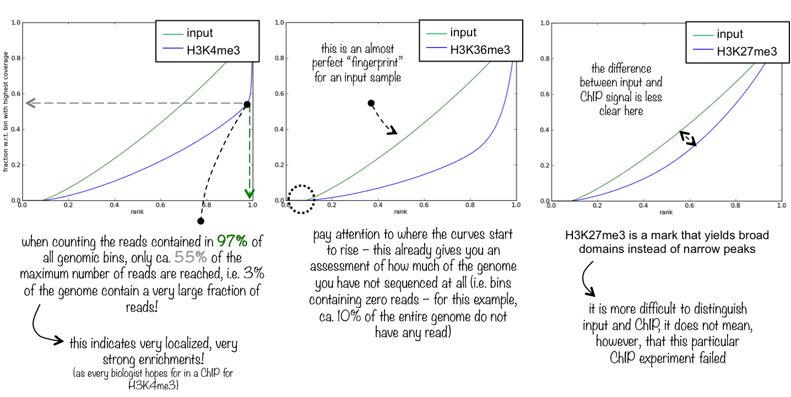
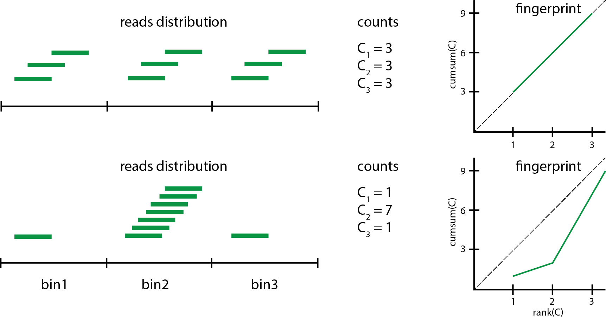

# ChIP-seq data analysis

Work in progress (August 2017)...

## General workflow

A typical workflow for the analysis of transcription factor (TF) ChIP-seq data may consist of the following steps. Tools are given in brackets.

1. Quality assessment of raw reads ([fastqc](http://www.bioinformatics.babraham.ac.uk/projects/fastqc/))
2. Adapter trimming and quality filtering ([cutadapt](http://cutadapt.readthedocs.io/en/stable/guide.html), [trimmomatic](http://www.usadellab.org/cms/?page=trimmomatic), [bbduk.sh](https://sourceforge.net/projects/bbmap/))
3. Read alignment to reference genome ([bowtie2](http://bowtie-bio.sourceforge.net/bowtie2/index.shtml))
4. Quality assessment of mapped reads ([QualiMap](http://qualimap.bioinfo.cipf.es/))
5. Read de-duplication ([samtools](http://www.htslib.org/), [picard-tools](https://broadinstitute.github.io/picard/))
6. ChIP library assessment ([deepTools](https://deeptools.github.io/))
7. Meta-gene analysis ([deepTools](https://deeptools.github.io/))
7. Peak calling ([MACS2](https://github.com/taoliu/MACS))

## Controls and replicate libraries

It is critical to have controls for the ChIP libraries to estimate non-specific binding across the genome. The two most frequently used methods use (1) DNA input samples, or (2) IgG "mock-ChIP" control samples. Various publications discuss potential benefits of one method over the other, and it appears that the choice of controls is to some extent based on individual experience and personal preference. Overall, the use of input DNA as controls seems to be preferred over IgG controls (see e.g. [Kiddler et al.](http://www.nature.com/ni/journal/v12/n10/abs/ni.2117.html), [Landt et al.](http://genome.cshlp.org/content/22/9/1813.long), [Meyer and Liu](http://www.nature.com/nrg/journal/v15/n11/full/nrg3788.html)). It is important to keep in mind that control libraries are subject to systematic biases due to genomic copy number variations, sequencing biases, read mapping ambiguities, and cell-type specific chromatin structure [[Vega et al.]](http://journals.plos.org/plosone/article?id=10.1371/journal.pone.0005241). 

The original 2012 ENCODE guidelines [[Land et al.]](http://genome.cshlp.org/content/22/9/1813.long) state that "more than two replicates did not significantly improve site discovery", and therefore define a standard for ChIP measurements to "be performed on two independent biological repliates". Results from more recent publications strongly encourage $n\geq 3$ replicate libraries to increase the reliability in the identification of binding sites. For example, [[Yang et al.]](https://www.ncbi.nlm.nih.gov/pmc/articles/PMC3962196/) demonstrate that a simple majority-rule-approach "identifies peaks more reliably in all biological replicates than the absolute concordance of peak identification between any two replicates, further demonstrating the utility of increasing replicate numbers in ChIP-seq experiments". 

## Library quality assessment

### Alignment stats

Following read alignment, `bowtie2`'s alignment summaries give a first insight into library quality and sequencing depth. Using an unmasked reference genome, mappability of input samples is commonly around 70-90%. In a repeat-masked reference genome, around 50% of the genomic sequence is identified as interspersed repeats and low-complexity DNA and masked with N's (see e.g. [RepeatMasker](http://www.repeatmasker.org/)); consequently, alignment of input reads against a repeat-masked reference genome will give lower mappability rates around 35-55%. For example, we use a repeat-masked mouse reference genome with an additional copy of the canonical rDNA repeat unit to explore protein binding to the rDNA, and obtain mappability rates of around 40% for high-quality input samples.  

### Read duplication

Generally, quality control of aligned reads should include an assessment of the duplication percentage of read (pairs). It is generally advisable to remove duplicate read pairs prior to proceeding with any down-stream analysis; however, some peak-callers (like MACS2) will indepedently remove read duplicates as part of their analysis workflow.

We can identify and mark duplicate reads using `picard-tools MarkDuplicates` and/or remove duplicates directly using `picard-tools MarkDuplicates REMOVE_DUPLICATES=TRUE`. Alternatively, we can use `samtools rmdup` to remove duplicates. The total percentage of duplicate reads and their chromosomal distribution provide insight into library complexity and biases.  

### Fingerprint plot

A powerful tool to assess the quality of libraries from a ChIP-seq experiment is to plot the *fingerprint* of a library. The term "fingerprint (plot)" has been coined by the deepTools dev's, but the original idea was introduced by [Diaz et al.](https://github.com/songlab/chance/wiki/CHANCE-Manual#checking-the-strength-of-enrichment-in-the-ip)

From [deepTools](http://deeptools.readthedocs.io/en/latest/content/tools/plotFingerprint.html):

> This quality control will most likely be of interest for you if you are dealing with ChIP-seq samples as a pressing question in ChIP-seq experiments is “Did my ChIP work?”, i.e. did the antibody-treatment enrich sufficiently so that the ChIP signal can be separated from the background signal? (After all, around 90% of all DNA fragments in a ChIP experiment will represent the genomic background).

The fingerprint of a ChIP/input library characterises how much of the genome (that is covered by reads) is covered by how large a fraction of the total number of reads. The following figure is taken from [deepTools' documentation](http://deeptools.readthedocs.io/en/latest/content/tools/plotFingerprint.html).

A simple example on how the fingerprint distribution is calculated from a read distribution is shown in the following diagram.

### Further QC

Further quality control checks typically involve a principle component analysis of read coverage (1) across the full (binned) genome, and (2) within identified common peak regions. Following appropriate centering of read counts, samples should separate along the first principle component according to whether they are input or ChIP libraries. Separation on the second principle component should then occur according to e.g. biological replicates, time-points or ChIP antibody (depending on the experiment design).

Additionally, a correlation analysis based on either counts directly or on their ranks gives a summary statistic characterising within-replicate reproducibility. It is important to keep in mind that Pearson's product moment correlation coefficient will dependent on the dynamic range of the two input variables; we therefore expect on average larger correlation coefficients in pairwise comparisons of input libraries than of ChIP libraries.

## References

1. [Bailey et al., Practical Guidelines for the Comprehensive Analysis of ChIP-seq Data, PLoS Comp. Biol. 9, e1003326 (2013)](http://journals.plos.org/ploscompbiol/article?id=10.1371/journal.pcbi.1003326)
2. [Ho et al., ChIP-chip versus ChIP-seq: Lessons for experimental design and data analysis, BMC Genomics 12, 134 (2011)](https://bmcgenomics.biomedcentral.com/articles/10.1186/1471-2164-12-134)
3. [Kidder, Hu and Zhao, ChIP-Seq: technical considerations for obtaining high-quality data, Nature Immunology 12, 918 (2011)](http://www.nature.com/ni/journal/v12/n10/abs/ni.2117.html)
4. [Landt et al., ChIP-seq guidelines and practices of the ENCODE and modENCODE consortia, Genome R5esearch 22, 1813 (2012)](http://genome.cshlp.org/content/22/9/1813.long)
5. [Meyer and Liu, Identifying and mitigating bias in next-generation sequencing methods for chromatin biology, Nature Reviews Genetics 15, 709 (2014)](http://www.nature.com/nrg/journal/v15/n11/full/nrg3788.html)
6. [Nakato and Shirahige, Recent advances in ChIP-seq analysis: from quality management to whole-genome annotation, Briefings in Bioinformatics 18, 279 (2017)](https://academic.oup.com/bib/article/18/2/279/2453282/Recent-advances-in-ChIP-seq-analysis-from-quality)
7. [Thomas et al., Features that define the best ChIP-seq peak calling algorithms, Briefings in Bioinformatics 18, 441 (2017)](https://academic.oup.com/bib/article/18/3/441/2453291/Features-that-define-the-best-ChIP-seq-peak)
8. [Vega et al., Inherent Signals in Sequencing-Based Chromatin-ImmunoPrecipitation Control Libraries, PLoS ONE 4, e5241 (2009)](http://journals.plos.org/plosone/article?id=10.1371/journal.pone.0005241)
9. [Yang et al., Leveraging biological replicates to improve analysis in ChIP-seq experiments, Comput. Struct. Biotechnol. J. 9, e201401002 (2014)](https://www.ncbi.nlm.nih.gov/pmc/articles/PMC3962196/)