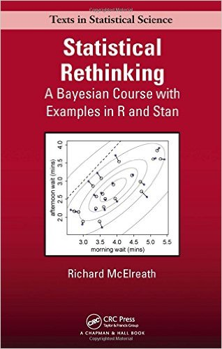
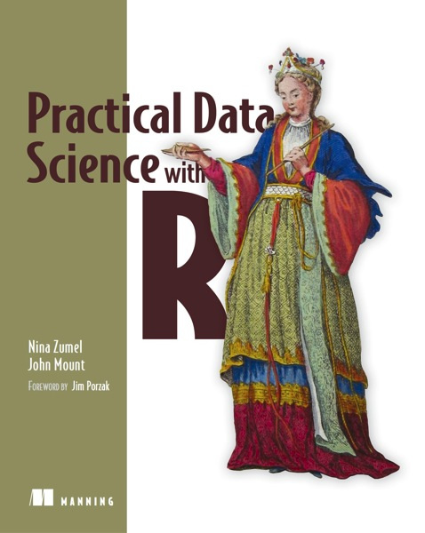

# Preface {-}

The following sections provide links to introductory reading material and resources to general statistics, bioinformatics, R programming, and various high-throughput sequencing (HTS) data analysis steps.

*Disclaimer: The list of resources is highly selective, and provides by no means a comprehensive database of all available resources. Instead I list books and resources that I personally have found (and continue to find) useful during my research.*

<!--chapter:end:index.Rmd-->

# General statistics and statistical modelling

## Books
Following are some great books that focus on a more practical introduction to statistics and statistical modelling (e.g. using R as a compute environment). The order of books loosely reflects the increase in complexity of the material covered.

[](http://www.bookdepository.com/STATS-Richard-D-de-Veaux/9780134243900)
[](https://www.bookdepository.com/Introductory-Statistics-with-R/9780387790534)
[](http://www.bookdepository.com/Statistical-Inference-George-Casell-Roger-Berger/9780495391876)
[](https://www.bookdepository.com/Statistical-Rethinking-Richard-McElreath/9781482253443)
[](https://www.bookdepository.com/Bayesian-Data-Analysis-Andrew-Gelman/9781439840955)

Many introductory statistics textbooks exist. I am listing here [*Stats - Data and models* by de Veaux](http://www.bookdepository.com/STATS-Richard-D-de-Veaux/9780134243900) as the most modern introductory statistics book. It has received (and continues to receive) very positive reviews, covers the basics and more, and is targeting undergraduate students across different disciplines (biomedical sciences, social sciences, political sciences, physics, etc.). Unfortunately it is not cheap.

[Dalgaard](https://www.bookdepository.com/Introductory-Statistics-with-R/9780387790534) and [Casella & Berger](http://www.bookdepository.com/Statistical-Inference-George-Casell-Roger-Berger/9780495391876) are two introductory and more advanced statistics textbooks. [McElreath](https://www.bookdepository.com/Statistical-Rethinking-Richard-McElreath/9781482253443) offers a fantastic introduction to Bayesian statistics and modelling, with a minimum dependence on existing stats and maths knowledge. [Gelman et al.](https://www.bookdepository.com/Bayesian-Data-Analysis-Andrew-Gelman/9781439840955) is a very comprehensive treatise on Bayesian data analysis containing many practical examples.    


## Free ebooks

[](https://www.openintro.org/stat/textbook.php)

I have not used the [OpenIntro Statistics](https://www.openintro.org/stat/textbook.php) book but reviews have been very favourable. It's also free. OpenIntro also offers additional reading and course material.


## Web sources, blogs and online forums

[CrossValidated](http://stats.stackexchange.com/)   

CrossValidated is an online forum for people interested in statistics, machine learning, and data analysis. CrossValidated focusses on the theory and methodology of analysing data rather than on programming language-specific issues. Make sure to search through the CrossValidated records before posting a new question.

<!--chapter:end:01-statistics.Rmd-->

# General bioinformatics

## Books
Following are some general introductory Bioinformatics textbooks.

[](https://leanpub.com/dataanalysisforthelifesciences) [](https://www.bookdepository.com/Statistical-Methods-in-Bioinformatics/9780387400822) [](https://www.bookdepository.com/Bioinformatics-Computational-Biology-Solutions-Using-R-Bioconductor-Robert-Gentleman/9780387251462)

[Irizarry & Love](https://leanpub.com/dataanalysisforthelifesciences) is a great pay-as-you-like textbook by two very well-known figures in the field (Rafael Irizarry is a statistican from the Havard School of Health with a long research and publication history in statistical Bioinformatics; Michael Love co-developed the differential gene expression analysis R package DESeq2).

I found [*Statistical Methods in Bioinformatics* by Ewens & Grant](https://www.bookdepository.com/Statistical-Methods-in-Bioinformatics/9780387400822) an excellent resource when I started learning about (statistical) Bioinformatics, combining a refresher in statistics with introductions to many computational/statistical Bioinformatics subjects.

[Gentleman et al.](https://www.bookdepository.com/Bioinformatics-Computational-Biology-Solutions-Using-R-Bioconductor-Robert-Gentleman/9780387251462) give many Bioinformatics examples using publicly available data and methods available in R/Bioconductor. Authors include very prominent figures in the field.

## Free Ebooks, notes, and manuscripts

[Krijnen, *Applied Statistics for Bioinformatics using R*](ftp://cran.r-project.org/pub/R/doc/contrib/Krijnen-IntroBioInfStatistics.pdf)

From the preface of Krijnen:

> "The purpose of this book is to give an introduction into statistics in order to solve some problems of bioinformatics. Statistics provides procedures to explore and visualize data as well as to test biological hypotheses. The book intends to be introductory in explaining and programming elementary statistical concepts, thereby bridging the gap between high school levels and the specialized statistical literature."

## Web sources, blogs and online forums

[Biostars](https://www.biostars.org)

Biostars is one of the active online forums where various Bioinformatics-related questions are regularly discussed.

---

[SEQanswers](http://seqanswers.com)

SEQanswers is the other online forum, again with a very active community. In comparison to Biostars, SEQanswer focusses on issues surrounding HTS data and its analysis.

<!--chapter:end:02-bioinformatics.Rmd-->

# R programming

*Disclaimer: The following sections list introductory and more advanced material on programming in R and is far from complete.*

The order of the materials in every section roughly reflects increasing complexity/difficulty/comprehensiveness. I am listing tutorial materials and notes first and (e)books second, because in my opinion learning R requires a practical learning-by-doing and following-examples type of approach. The best thing to do is to "start coding" yourself right from the start.

It goes without saying that in order to execute R code, you need to install the R compute environment on your local computer. You can download R from the [R Project](https://www.r-project.org/).

[RStudio](https://www.rstudio.com/products/RStudio/) is a full IDE (integrated development environment) for code development, including an editor and tools for code management, debugging, and plotting. I highly recommend using it.

## Tutorial and notes

[Gautier, *R crash course*](http://www.cbs.dtu.dk/courses/thaiworkshop/exercises/crashR.2.pdf): A short (17 pages) crash course on programming in R.

I recommend this as a half-day crash-course introduction to R. I have used this material in the past when running R-based gene expression analysis courses for biologists.

---

[Venables et al., *An Introduction to R*](https://cran.r-project.org/doc/manuals/R-intro.pdf): Fairly comprehensive notes (105 pages) on R from CRAN.

This is a step up from the crash-course overview. Working through this should give you a good practical working knowledge of how to "do things" in R. Either read front-to-back or use alongside implementing some simple R projects.

---

[Phillips, *Yarrr! The pirate's guide to R*](https://drive.google.com/file/d/0B4udF24Yxab0S1hnZlBBTmgzM3M/view): From the book

> "This book is meant to introduce you to the basic analytical tools in R, from basic coding and analyses, to data wrangling, plotting, and statistical inference."

Phillips more or less covers similar ground to Venables, and also introduces some popular and useful R packages from the [tidyverse](https://blog.rstudio.org/2016/09/15/tidyverse-1-0-0/).

---

[Wickham, *Advanced R*](http://adv-r.had.co.nz/): From the website

> "The book is designed primarily for R users who want to improve their programming skills and understanding of the language."

From the master himself.

## Ebooks

Some of the following books cover very advanced topics. I would not recommend an R beginner starting with these; however, topics covered in these book will become relevant as computational R projects become more complex.  

---
[](https://www.manning.com/books/practical-data-science-with-r)

[Gillespie & Lovelace](https://csgillespie.github.io/efficientR/index.html) have an online version of their O'Reilly book [*Efficient R programming*](https://www.amazon.com/Efficient-Programming-Practical-Guide-Smarter/dp/1491950781). From the website:

> "There are many excellent R resources for visualization, data science, and package development. Hundreds of scattered vignettes, web pages, and forums explain how to use R in particular domains. But little has been written on how to simply make R work effectively—until now. This hands-on book teaches novices and experienced R users how to write efficient R code."


---

[](https://www.manning.com/books/practical-data-science-with-r)

[Zumel & Mount](https://www.manning.com/books/practical-data-science-with-r) has received a lot of positive reviews. From the website:

> "Practical Data Science with R lives up to its name. It explains basic principles without the theoretical mumbo-jumbo and jumps right to the real use cases you'll face as you collect, curate, and analyze the data crucial to the success of your business. You'll apply the R programming language and statistical analysis techniques to carefully explained examples based in marketing, business intelligence, and decision support."

---

[](https://www.manning.com/books/practical-data-science-with-r)


[Wickham & Grolemund](http://r4ds.had.co.nz) have an online version of their upcoming (late 2016) O'Reilly book [*R for Data Science*](https://www.amazon.com/R-Data-Science-Hadley-Wickham/dp/1491910399/ref=as_li_ss_tl?ie=UTF8&qid=1469550189&sr=8-1&keywords=R+for+data+science&linkCode=sl1&tag=devtools-20&linkId=6fe0069f9605cf847ed96c191f4e84dd).

---

[](https://www.manning.com/books/practical-data-science-with-r)


[James et al., *An Introduction to Statistical Learning with Applications in R*](http://www-bcf.usc.edu/~gareth/ISL/): From the website:

> "This book provides an introduction to statistical learning methods. It is aimed for upper level undergraduate students, masters students and Ph.D. students in the non-mathematical sciences. The book also contains a number of R labs with detailed explanations on how to implement the various methods in real life settings, and should be a valuable resource for a practicing data scientist."

This book can be considered the *little brother* of [*The Elements of Statistical Learning*](http://statweb.stanford.edu/~tibs/ElemStatLearn/).


## Online courses

Various online courses exist. Following are two sites that provide links to practical online R courses. Some are free, some are not.

---

[R course finder](http://r-exercises.com/r-courses/): Provides a list of nearly 100 R courses, offered by various universities and institutes, in different formats, and at different costs (starting from free).

---

[R courses on coursera](https://www.coursera.org/courses?languages=en&query=r+programming): Introductory R courses exist from Johns Hopkins and Duke universities.

## Web sources, blogs and online forums

R has a very active community, and in my experience staying up to date with new developments requires at least occasionally following various web sources.

---

[https://cran.r-project.org/](https://cran.r-project.org/)

The Comprehensive R Archive Network (CRAN) is the central platform for R package distribution. Here you can search for available R packages, and access the often extensive R package documentation (in the form of vignettes and reference manuals).

All packages from CRAN can be installed directly from within R.
```{r}
install.packages("package_name");
```

---

[https://www.bioconductor.org/](https://www.bioconductor.org/)

Bioconductor provides tools for the statistical analysis and visualisation of HTS data. This includes specialised R packages (including extensive vignettes and reference manuals) and tutorials.

All R/Bioconductor packages can be installed directly from within R.
```{r}
source("https://www.bioconductor.org/biocLite.R");
biocLite("package_name");
```
---

[https://www.r-bloggers.com/](https://www.r-bloggers.com/)

R-bloggers is an aggregate blog site, with news surrounding R package development, R tutorials and general R updates. Articles cover a very broad spectrum of R applications.

---

[http://stackoverflow.com/](http://stackoverflow.com/)

Help for R-related programming questions can be found on Stack Overflow. Before posting a new question, make sure to search through their records of R-related questions. Chances are generally very high that somebody has had a similar issue at some point in the past.

<!--chapter:end:03-R.Rmd-->

# RNA-seq data analysis

Many resources and introductory tutorials to typical RNA-seq workflows exist on the web. The choice of tools and computational methods is often a matter of choice. Generally R/Bioconductor is a great resource for HTS-data related tutorials.

Often the best approach is to locally reproduce results discussed as part of different tools. For example, most R/Bioconductor packages provide sample analyses and case studies as part of their vignettes.   

## General workflow

A typical RNA-seq data analysis workflow may consist of (some or all of) the following steps (in brackets are tools that I have used in the past):

1. Quality assessment of raw reads ([fastqc](http://www.bioinformatics.babraham.ac.uk/projects/fastqc/))
2. Adapter trimming and quality filtering ([cutadapt](http://cutadapt.readthedocs.io/en/stable/guide.html), [trimmomatic](http://www.usadellab.org/cms/?page=trimmomatic), [bbduk.sh](https://sourceforge.net/projects/bbmap/))
3. Read alignment to reference genome ([bowtie2](http://bowtie-bio.sourceforge.net/bowtie2/index.shtml), [tophat](https://ccb.jhu.edu/software/tophat/index.shtml), [bwa-mem](http://bio-bwa.sourceforge.net/), [STAR](https://github.com/alexdobin/STAR))
4. Quality assessment of mapped reads ([RseQC](http://rseqc.sourceforge.net/), [QoRTs](https://github.com/hartleys/QoRTs))
5. Read de-duplication ([samtools](http://www.htslib.org/), [picard-tools](https://broadinstitute.github.io/picard/))
6. Count summarisation ([HTSeq](http://www-huber.embl.de/users/anders/HTSeq/), [featureCounts](http://bioinf.wehi.edu.au/featureCounts/))
7. Differential gene expression analysis ([DESeq2](https://bioconductor.org/packages/release/bioc/html/DESeq2.html), [limma](https://bioconductor.org/packages/release/bioc/html/limma.html), [edgeR](http://bioconductor.org/packages/release/bioc/html/edgeR.html))
8. Gene ontology enrichment analysis/Gene set enrichment analysis ([clusterProfiler](https://bioconductor.org/packages/release/bioc/html/clusterProfiler.html), [GSEA](http://software.broadinstitute.org/gsea/index.jsp))

---

[Conesa et al.](https://genomebiology.biomedcentral.com/articles/10.1186/s13059-016-0881-8) have published a survey of best practices for RNA-seq data analysis that provides a nice overview of typical analysis steps and how to critically assess results.


---

[Griffith lab RNA-seq tutorial](https://github.com/griffithlab/rnaseq_tutorial/wiki)

Griffith et al. provide an online Wiki-style RNA-seq tutorial with exercises.

## Differential gene expression (DGE) analysis

I can specifically recommend the following three tutorials/vignettes surrounding the R packages DESeq2 and limma. In terms of the underlying statistical model, there exists a lot of overlap between DESeq2 and limma. Whether to use one over the other is therefore largely a matter of choice. Both methods are often regarded as the gold-standard methods in regards to DGE analyses.

---

[http://www.bioconductor.org/help/workflows/rnaseqGene/](http://www.bioconductor.org/help/workflows/rnaseqGene/)

R/Bioconductor has a good tutorial on how to get from raw RNA-seq data to identifying differentially expressed genes.


---

[DESeq2](https://www.bioconductor.org/packages/release/bioc/html/DESeq2.html)

The vignette is regularly updated and offers a great tutorial on how to perform differential gene expression analyses within R. The vignette also provides details on the underlying statistical modelling approach. Personally, I slightly favour the DESeq2 documentation and approach in my own research analyses.

---

[Limma](https://www.bioconductor.org/packages/release/bioc/html/limma.html)

The user guide offers an excellent tutorial using a wide range of different sample case studies on performing differential gene expression analyses within R.


## Fusion gene identification

Various fusion/chimeric transcript identification tools exist.

---
[Kumar et al.](http://www.nature.com/articles/srep21597) performed a quantitative assessment of 12 fusion detection tools in their recent 2016 Nature paper.

---

[Liu et al.](http://nar.oxfordjournals.org/content/44/5/e47) performed a similar benchmark analysis of 15 fusion detection tools in their 2015 Nucleic Acids Research paper.

---

Another list of 39 (as of December 2016) fusion detection tools in given on [Biostars](https://www.biostars.org/p/45986/).  

---

[InFusion](https://bitbucket.org/kokonech/infusion/overview)

InFusion is one of the most recently published tools. It was written in C++/Python, and provides detailed instructions on how to compile the source code, and run the program.

---

<!--chapter:end:04-RNAseq.Rmd-->

